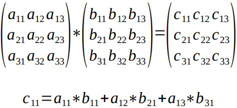
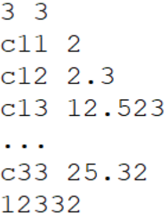

# UNIVERSIDADE FEDERAL DO RIO GRANDE DO NORTE - INSTITUTO METRÓPOLE DIGITAL

## Trabalho Prático 1 – Processos, Memória compartilhada e Sincronização
Uma das principais características do sistema operacional é
possibilitar a *multiprogramação*, também conhecida como *programação paralela*. A
programação paralela permite que usemos mais de um processo e/ou thread para
resolver problemas mais rapidamente do que eles seriam resolvidos se fossem feitos de
forma sequencial.

Na prática, o sistema operacional não precisa de várias CPUs ou mesmo de uma
CPU *multicore* para possibilitar que um programa seja implementado usando várias
threads ou processos, no entanto, fazer isso em sistemas sem essas características
implica que o tempo final de resposta vai ser igual ou até pior do que a solução
sequencial.

Além das características do sistema onde executamos o programa, o próprio
problema impõe restrições que implicam na qualidade do resultado. Em alguns casos, os
problemas podem ser impossíveis de dividir em tarefas que podem ser executadas em
paralelo, existe ainda um postulado que diz que mesmo em um problema que permita
uma paralização extrema, existe uma pequena porção que é indivisível fazendo com que
o ganho por paralelização nunca seja linear.

### Exemplo prático de programação paralela

Um exemplo de problema que tem bastante importância para a computação e ao
mesmo tempo possui um ganho teórico muito bom quando usamos programação
paralela é a multiplicação de matrizes. Como exemplificada na figura abaixo:

 
## Screenshots  

 
 O caso acima mostra o resultado da multiplicação de matrizes para uma matriz
3x3 e é um exemplo prático que mostra uma característica muito importante quando
avaliamos as possiblidades para escrever uma solução paralela para um problema, a
**independência dos dados**. Na multiplicação de matrizes um dado elemento pertencente
à resultado é independente dos demais, ou seja, cada elemento da matriz resultado, cnm,
pode ser calculado independentemente dos demais, apenas lendo os valores das matrizes
a serem multiplicadas.

Neste trabalho implementaremos a multiplicação de matrizes usando alguns
cenários e faremos comparações e discussões em relação à velocidade das
implementações paralelas e sequenciais.

### Etapa 1 – Projeto Base

O projeto base consiste em três programas básicos que serão modificados e
analisados em cada uma das etapas seguintes. Os programas base são:

I. **Auxiliar** - Um programa que receba através da linha de comando 4
argumentos (n1, m1, n2, m2), representando as dimensões de 2 matrizes
que serão multiplicadas. Usando os 4 argumentos o programa deve gerar
aleatoriamente duas matrizes, M1 e M2, de dimensões n1 x m1 e n2 x m2.
Cada matriz deve ser gravada em um arquivo separado, que será usado
pelos próximos programas. O formato do arquivo que representa as
matrizes pode ser o mesmo parecido com o mostrado na Figura 1, mas
fique à vontade neste caso.

II. **Sequencial** - Um programa que recebe como entrada dois arquivos que
descrevem duas matrizes M1 e M2, através da linha de comando. O
programa deve implementar a multiplicação das matrizes M1 e M2, de
forma convencional e salvar o resultado em um arquivo, o programa deve
salvar no arquivo o tempo que passou calculando o resultando.

* Para o arquivo de resultado use o formato mostrado na Figura 1.

*Figura 1, formato do arquivo contendo 3 elementos de uma matriz 3 x 3. A primeira linha contém o  tamanho da matriz, as linhas seguintes os valores de cmn terminando com o tempo para calcular o resultado.*

III. **Paralelo Threads** - Um programa que recebe como entrada dois arquivos
que descrevem duas matrizes M1 e M2 e um número inteiro P, através da
linha de comando. O programa deve implementar a multiplicação de
matrizes através de threads, para cada P elementos da matriz resultado
**uma *thread*** deve ser criada. O programa deve inicialmente abrir, ler os
números e fechar o arquivo **antes de criar as *threads***.

* Neste caso ao invés de salvar apenas 1 arquivo para o resultado,
crie [ (n1 × m2) ÷ P ] arquivos, um para cada parte do resultado, para
facilitar todos os arquivos devem iniciar com o tamanho da matriz
total, mesmo que tenham apenas um segmento dela. O programa
deve salvar no arquivo o tempo que passou calculando cada
resultado individual. Junte os arquivos depois, se preferir, mas faça
isso fora do programa. 

IV. **Paralelo Processos** - Um programa que recebe como entrada dois
arquivos que descrevem duas matrizes M1 e M2 e um número inteiro P,
através da linha de comando. O programa deve implementar a
multiplicação de matrizes através de processos diferentes, para cada P
elementos da matriz resultado um **novo processo** deve ser criado. O
programa deve inicialmente abrir, ler os números e fechar o arquivo **antes de criar os processos**.

* Neste caso ao invés de salvar apenas 1 arquivo para o resultado,
crie [ (n1 × m2) ÷ P ] arquivos, um para cada parte do resultado, para
facilitar todos os arquivos devem iniciar com o tamanho da matriz
total, mesmo que tenham apenas um segmento dela. O programa
deve salvar no arquivo o tempo que passou calculando cada
resultado individual. Junte os arquivos depois, se preferir, mas faça
isso fora do programa.

### Etapa 2 – Sequencial vs Paralelo

Usando os programas base é possível comparar os tempos de execução de cada uma das
soluções de uma forma relativamente simples: I) na implementação paralela o tempo total
está no fim do arquivo; II) nas implementações com threads e com processos o tempo total é,
aproximadamente, o maior tempo entre todos os tempos intermediários listados disponíveis
no arquivo. Usando esses tempos realize os seguintes estudos:

E1) Execute cada um dos programas **Sequencial, Paralelo Threads** e **Paralelo Processos**,
com diversos tamanhos de M1 e M2, inicie com 100x100 e vá multiplicando os
tamanhos por 2 até que o tempo de cálculo do programa **Sequencial** fique, pelo
menos, **2 minutos**. No caso dos programas paralelos, use um valor de P igual a [ (n1 × m2) ÷ 8 ] .

* Execute 10 vezes cada multiplicação, para um determinado tamanho de matriz, e calcule o tempo médio entre essas 10 vezes.
* Faça um gráfico que mostre o tempo médio decorrido por cada programa em função do tamanho da matriz final.

E2)  Usando as mesmas matrizes achadas no Experimento E1, que fazem com que o tempo
de cálculo do Programa Sequencial demore 2 minutos, teste diferentes valores de P,
iniciando em [ (n1 × m2) ÷ 8 ] , e depois reduzindo até um quarto deste valor inicial;
depois aumentando até [ (n1 × m2) ÷ 2 ] . Escolha um incremento de valor em P que
faça sentido para as plotagens a seguir:

* Execute 10 vezes cada multiplicação, para um determinado valor de P, e calcule o tempo médio entre essas 10 vezes.
* Faça um gráfico que mostre o tempo médio decorrido por cada programa em função do valor de P.

### Etapa 3 – Discussões

Use os gráficos gerados para discutir as seguintes questões:

a) Qual o motivo dos resultados obtidos no experimento E1? O que pode ter causado o comportamento observado?

b) Qual o motivo dos resultados obtidos no experimento E2? O que pode ter causado o comportamento observado?

c) Qual é o valor de P ideal para a multiplicação das matrizes M1 e M2? Justifique sua resposta através dos experimentos realizados.

## Comando para funcionamento do projeto
~~~c
Ubuntu on Windows:
apt install gcc
gcc auxiliar.c -o auxiliar
./auxiliar 2 2 3 3
~~~  